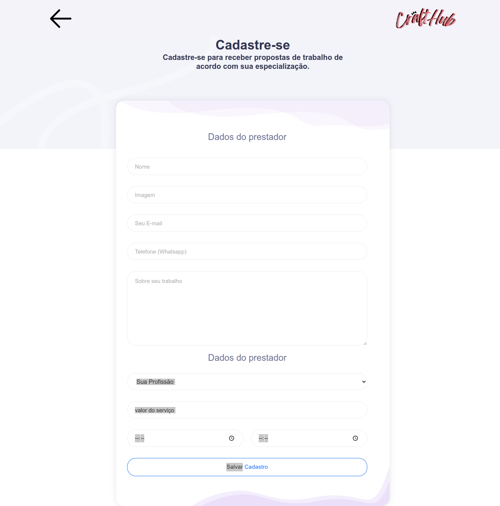

<h1 align="center">
    
</h1>

  CraftHub é uma aplicação para contratar profissionais de serviçoes essenciais para o lar ou empresa. A finalidade do projeto é aproximar profissionais e pessoas afim de proporcionar mais facilidade no contrato. O craftHub, possui o cadastra de diversos tipos de profissionais, faxineiros, encanadores, pedreitos e o mais variádos profissionais. O intuito do desenvolvimento dessa aplicação é colocar em prática os meus conhecimentos em TypeScript com Node e React e também o de organização e padrões de projetos.

---

   
   
   

---

### Ferramentas utilizadas na aplicação:

- [Axios](https://github.com/axios/axios)
- [ReactJS](https://vitejs.dev/).

### Ferramentas utilizadas no ambiente de desenvolvimento:

- [ESLint](https://github.com/eslint/eslint) - Lint para identificar erros em tempo de desenvolvimento.
- [Prettier](https://github.com/prettier/prettier) - Padroniza e melhora a visualização do código.

---

## :memo: Licença

Feito com :purple_heart: by [Michael W.Lopes](https://github.com/michael23-lopes)

---
